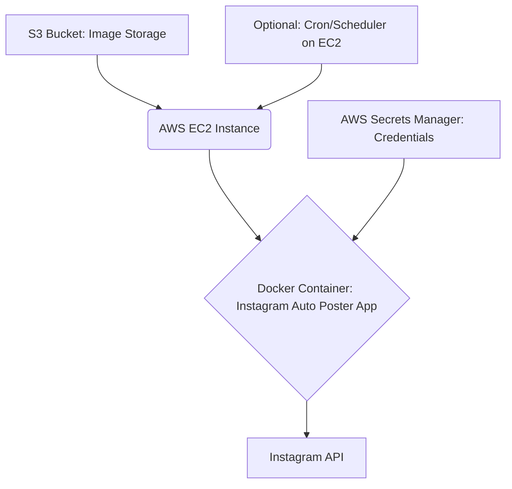

# Architecture Overview: Instagram Auto Poster (EC2 Edition)

This document outlines the architectural design of the Instagram Auto Poster, an automated solution for posting images to Instagram from an S3 bucket, deployed securely and reliably on AWS EC2 with Docker Compose and AWS Secrets Manager.

## 1. High-Level Architecture

The system operates as a scheduled task (or manually triggered) that fetches images from an S3 bucket, processes them to meet Instagram's requirements, and then posts them. AWS services are heavily utilized for deployment, security, and storage.

## 2. Component Breakdown

### 2.1 S3 Bucket
- **Purpose**: Acts as the primary storage for images awaiting posting. Images are picked based on their recency (least recent first).
- **Key Features**: Scalable, highly available object storage.

### 2.2 AWS EC2 Instance
- **Purpose**: Hosts the Docker container running the Instagram Auto Poster application. Provides a persistent environment with a static IP for reliable operation.
- **Key Features**: Virtual server in the cloud, configurable resources (CPU, Memory), attachment of IAM roles for secure AWS service access.

### 2.3 Docker Container
- **Purpose**: Encapsulates the application and its dependencies, ensuring consistent execution across environments (local development, EC2).
- **Technologies**: Python, FastAPI.
- **Key Features**:
    - **Image Processing**: Resizing, quality optimization (100% JPEG quality within 8MB limit), aspect ratio handling (white padding).
    - **Image Validation**: Ensures images meet Instagram's specifications before posting.
    - **Instagram Integration**: Handles the actual posting process via the Instagram API.
    - **Error Handling**: Graceful handling of failures and exceptions during image processing and posting.

### 2.4 Instagram API
- **Purpose**: The interface through which the application interacts with Instagram to post images.

### 2.5 AWS Secrets Manager
- **Purpose**: Securely stores sensitive credentials such as Instagram username/password and AWS access keys.
- **Key Features**: Centralized secret management, integration with EC2 IAM roles for secure access by the application.

### 2.6 Optional: Cron/Scheduler
- **Purpose**: Provides automated, scheduled triggering of the Instagram Auto Poster application on the EC2 instance (e.g., daily posts).

## 3. Data Flow

1. **Image Ingestion**: Images are manually uploaded or programmatically placed into the designated S3 bucket.
2. **Trigger (Manual/Scheduled)**: The Docker container on EC2 is triggered.
3. **Credential Retrieval**: The application within the Docker container fetches necessary credentials (Instagram, AWS) from AWS Secrets Manager.
4. **Image Selection**: The application identifies and retrieves the least-recent image from the S3 bucket.
5. **Image Processing & Validation**: The retrieved image undergoes resizing, quality optimization, and validation to conform to Instagram's requirements.
6. **Instagram Posting**: The processed image is posted to Instagram via its API.
7. **Post-Processing**: (Implicit) The posted image might be moved or deleted from S3, or marked as processed to avoid re-posting.

## 4. Security Considerations (Architecture Perspective)

- **Secrets Management**: Centralized and secure storage of all credentials in AWS Secrets Manager. No hardcoded secrets.
- **IAM Roles**: EC2 instances are granted specific IAM roles (e.g., `SecretsManagerReadWrite`) to access necessary AWS services, adhering to the principle of least privilege.
- **Network Security**: Implicitly, EC2 security groups and network ACLs would control inbound/outbound traffic.

## 5. Deployment Architecture

The application is deployed using Docker Compose on an AWS EC2 instance. The `Dockerfile.ec2` and `docker-compose.yml` facilitate this deployment. This setup ensures persistence and easy management of the application container.

This document will be updated as the architecture evolves or more detailed components are identified.
